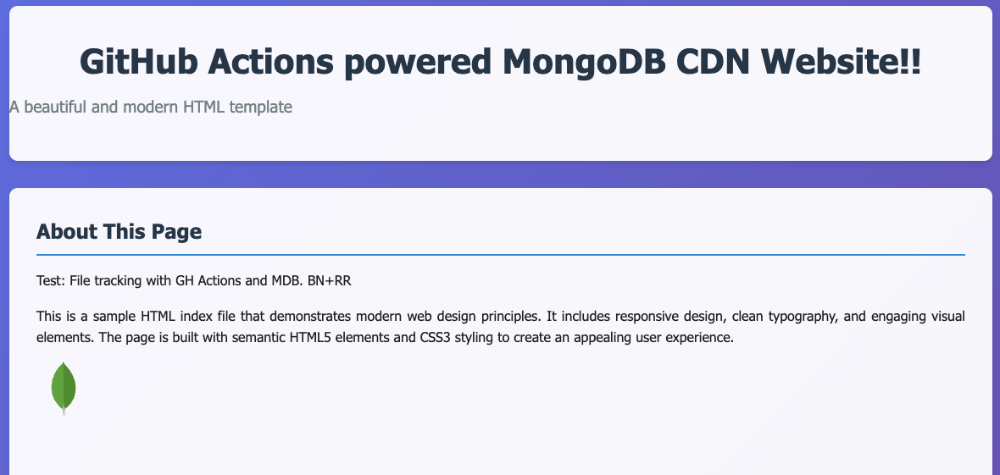

# CDN on MongoDB via GitHub Actions

Show the possibility of using MongoDB as a backend for a CDN architecture where all the assets are stored both as files in a GitHub repo but also as versioned objects in MongoDB to be later retrieved by NextJS ISR (Incremental Static Regeneration) to demonstrate combining Static and Dynamic data/pages with hybrid rendering.

**OBJECTIVES**
- Timestamp and version control each .HTML and .CSS file along with it's metadata like `path`.
- Updates to files in GitHub result in updated versions in MongoDB using GitHub Action
- Application pulls latest version of the file from MongoDB and renders it.

## Step 1: Add MongoDB URI and Atlas Secrets to GitHub Secrets

First, you need to securely store your MongoDB connection string and MongoDB Atlas secrets so the GitHub Action can access it without exposing it in your code.

In your GitHub repository, go to **Settings > Secrets and variables > Actions**.

Click New repository secret.

Name the secret `MONGO_URI`.

For the value, paste your full MongoDB connection string (including your username, password, and database name).

Example: `mongodb+srv://<username>:<password>@yourcluster.mongodb.net/file_versions?retryWrites=true&w=majority`

Click Add secret.

1. [Configure Atlas CLI API Keys](https://www.mongodb.com/docs/atlas/configure-api-access/) for your organization or project.
2. Add the API Keys to the [repository secrets](https://docs.github.com/en/actions/security-guides/encrypted-secrets).
3. Set the environment secrets `MONGODB_ATLAS_PUBLIC_API_KEY` , `MONGODB_ATLAS_PRIVATE_API_KEY` and `MONGODB_ATLAS_PROJECT_ID` to the Atlas CLI API Keys you configured.
See [Atlas CLI Environment Variables](https://www.mongodb.com/docs/atlas/cli/stable/atlas-cli-env-variables/) for all supported environment variables.

## Step 2: Add or modify assets

Our example has an `index.html` document in the root of the folder and a `public/styles.css`.  

You can either modify these files or add additional `*.HTML` files in the root or any additional `*.CSS` files in the `public/` folder.

Upon committing these changes, the workflow will contact MongoDB Atlas to add temporary access from the GitHub runners IP address, it will promptly remove this access upon completion of the workflow.

## Step 3: View assets

Using NextJS ISR and a query to MongoDB to generate functional webpage with .HTML and .CSS.

```bash
cd webapp
npm install
npm run dev
```

Open your browser to `http://localhost:3000`


